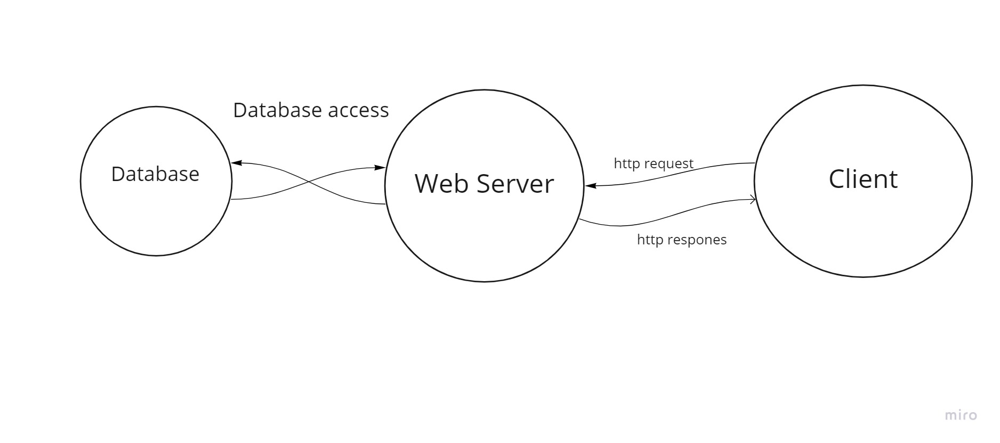

# City Exploer

## Author: Hamzah Aldaamas Version: 1.0.0.

# Overview
 > Using an API, the app will enable the user to conduct searches across all of the database's cities.

## Getting Started
1. build react application UI 
2. take from form city name.
3. search in api about city name.
4. display the conent about city.

## Architecture
Reactjs, BootStrap, css ,axios, LocationIQ

## Change Log

## Credit and Collaborations

Name of feature: locations

Estimate of time needed to complete: 1 hour

Start time: 2:00

Finish time: 3:30

Actual time needed to complete: 1 hour and half

Name of feature: maps

Estimate of time needed to complete: 1 hour

Start time: 5:00

Finish time: 6:00

Actual time needed to complete: 1 hour

Name of feature: error

Estimate of time needed to complete: 30 minuts

Start time: 7:00

Finish time: 7:45

Actual time needed to complete: 45 minuts

